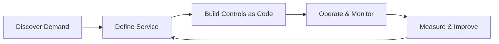

# cloud-security-service-model

**Tagline:** A pragmatic, enterprise Cloud Security service operating model (Azure + Hybrid)

## What this repo is
This repository is a public-safe, enterprise-grade operating model for a **Cloud Security Service** delivered as a
service/product. It defines scope, boundaries, governance, metrics, runbooks, and implementation stubs to help platform
and security leaders stand up a predictable, measurable cloud security capability.

## Who it’s for
- Head of Cloud Platform Services
- Security leadership (CISO org)
- Cloud engineering leads
- Audit/compliance stakeholders

## Problem it solves
Organizations often treat cloud security as a toolset. This repo reframes it as a **service** with clear ownership,
interfaces, measurable outcomes, and lifecycle management across Azure and hybrid/on-prem environments.

## Scope
- Azure and hybrid coverage (Azure Arc and Azure Local/on-prem)
- Policy, identity, logging, incident response, and governance
- Controls as Code examples (policy, IaC, detection)

## Non-scope
- Tenant-specific configurations or secrets
- Production-ready infrastructure code
- Vendor-specific operational details beyond Azure and hybrid scope

## Service boundaries (summary)
- **We do:** define standards, manage policy-as-code, enable monitoring, coordinate incident response, provide evidence.
- **We don’t:** own app code, operate app teams’ pipelines, or run business application production on their behalf.

## How to consume
1. Start with the executive overview and service definition.
2. Use the operating model and KPIs to set expectations.
3. Apply the templates and runbooks in operational workflows.
4. Extend implementation stubs in your own environment.

## Quick navigation
- Executive overview: [`docs/00-executive-overview.md`](docs/00-executive-overview.md)
- Service definition: [`docs/01-service-definition.md`](docs/01-service-definition.md)
- Operating model: [`docs/05-operating-model.md`](docs/05-operating-model.md)
- Metrics & KPIs: [`docs/07-metrics-and-kpis.md`](docs/07-metrics-and-kpis.md)
- Roadmap & maturity: [`docs/08-roadmap-and-maturity.md`](docs/08-roadmap-and-maturity.md)
- Hybrid/Azure Local: [`docs/18-hybrid-azure-local.md`](docs/18-hybrid-azure-local.md)
- Runbooks: [`docs/20-runbooks/README.md`](docs/20-runbooks/README.md)
- Templates: [`docs/21-templates/README.md`](docs/21-templates/README.md)
- Diagrams: [`docs/22-diagrams/README.md`](docs/22-diagrams/README.md)
- Static site: [`docs/site/index.html`](docs/site/index.html)
- Static site: [`site/index.html`](site/index.html)

## Service lifecycle (preview)

## ISO 27001 / CISSP mapping (high level)
- **ISO 27001**: The service model maps to control intent areas such as access control, logging, incident response,
  change management, and risk treatment. See the mapping table in
  [`docs/10-audit-readiness.md`](docs/10-audit-readiness.md).
- **CISSP domains**: Coverage spans Security & Risk Management, Asset Security, Security Engineering, IAM, Security
  Assessment, Security Operations, and Software Development Security. See
  [`docs/00-executive-overview.md`](docs/00-executive-overview.md).

## Using the static site
Open [`docs/site/index.html`](docs/site/index.html) to browse a minimal HTML version of the content with navigation and search.
Open [`site/index.html`](site/index.html) to browse a minimal HTML version of the content with navigation and search.

## Repo structure
The repository includes:
- `/docs` — service model documentation and diagrams
- `/impl` — Azure and hybrid implementation stubs
- `/agile` — backlog, ceremonies, and metrics
- `/site` — lightweight static documentation site

## License
See [`LICENSE`](LICENSE).
