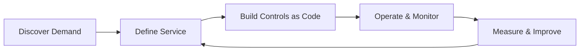

# cloud-security-service-model

 

**Enterprise cloud security operating model** for Azure and hybrid environments - defines service scope, governance, controls-as-code, metrics, and measurable outcomes for security leaders and platform teams.

Part of the [Coding-Autopilot-System](https://github.com/Coding-Autopilot-System) portfolio of enterprise AI and platform engineering artifacts.

## What this repo is

This repository is a public-safe, enterprise-grade operating model for a **Cloud Security Service** delivered as a
service/product. It defines scope, boundaries, governance, metrics, runbooks, and implementation stubs to help platform
and security leaders stand up a predictable, measurable cloud security capability.

It is intentionally written as a service architecture asset, not a product brochure. The value is in showing how
security, platform engineering, governance, and controls-as-code fit together as an enterprise operating model.

## Who it's for

- Head of Cloud Platform Services
- Security leadership (CISO org)
- Cloud engineering leads
- Audit/compliance stakeholders

## Problem it solves

Organizations often treat cloud security as a toolset. This repo reframes it as a **service** with clear ownership,
interfaces, measurable outcomes, and lifecycle management across Azure and hybrid/on-prem environments.

For hiring and portfolio review, that makes the repo useful as evidence of architecture thinking beyond raw
infrastructure delivery: service design, operating model definition, control ownership, auditability, and cross-team
interfaces.

## Why it matters in a broader AI/platform portfolio

This repo keeps a strict cloud security identity, but it also demonstrates capabilities that matter across adjacent
platform domains:

- Designing shared services with explicit boundaries, consumers, and measurable outcomes
- Converting governance intent into controls-as-code, implementation stubs, and runbooks
- Establishing identity, logging, and change-management foundations required by AI and platform workloads
- Producing audit-friendly documentation that platform, security, and engineering leaders can all use

In other words, this is the security operating model that supports higher-level platform and AI services without
pretending to be those services.

## Scope

- Azure and hybrid coverage (Azure Arc and Azure Local/on-prem)
- Policy, identity, logging, incident response, and governance
- Controls as Code examples (policy, IaC, detection)

## Non-scope

- Tenant-specific configurations or secrets
- Production-ready infrastructure code
- Vendor-specific operational details beyond Azure and hybrid scope

## Service boundaries (summary)

- **We do:** define standards, manage policy-as-code, enable monitoring, coordinate incident response, provide evidence.
- **We don't:** own app code, operate app teams' pipelines, or run business application production on their behalf.

## How to consume

1. Start with the executive overview and service definition.
2. Use the operating model and KPIs to set expectations.
3. Apply the templates and runbooks in operational workflows.
4. Extend implementation stubs in your own environment.

## Quick navigation

- Executive overview: [`docs/00-executive-overview.md`](docs/00-executive-overview.md)
- Service definition: [`docs/01-service-definition.md`](docs/01-service-definition.md)
- Operating model: [`docs/05-operating-model.md`](docs/05-operating-model.md)
- Metrics & KPIs: [`docs/07-metrics-and-kpis.md`](docs/07-metrics-and-kpis.md)
- Roadmap & maturity: [`docs/08-roadmap-and-maturity.md`](docs/08-roadmap-and-maturity.md)
- Hybrid/Azure Local: [`docs/18-hybrid-azure-local.md`](docs/18-hybrid-azure-local.md)
- Runbooks: [`docs/20-runbooks/README.md`](docs/20-runbooks/README.md)
- Templates: [`docs/21-templates/README.md`](docs/21-templates/README.md)
- Diagrams: [`docs/22-diagrams/README.md`](docs/22-diagrams/README.md)
- Threat model: [`docs/23-threat-model.md`](docs/23-threat-model.md)
- Static site: [`docs/index.html`](docs/index.html)
- [Wiki](https://github.com/Coding-Autopilot-System/cloud-security-service-model/wiki) - overview, service definition, architecture, metrics & compliance

## Service lifecycle

```mermaid
graph LR
  A[Discover Demand] --> B[Define Service]
  B --> C[Build Controls as Code]
  C --> D[Operate & Monitor]
  D --> E[Measure & Improve]
  E --> B
```

## ISO 27001 / CISSP mapping (high level)

- **ISO 27001**: The service model maps to control intent areas such as access control, logging, incident response,
  change management, and risk treatment. See the mapping table in
  [`docs/10-audit-readiness.md`](docs/10-audit-readiness.md).
- **CISSP domains**: Coverage spans Security & Risk Management, Asset Security, Security Engineering, IAM, Security
  Assessment, Security Operations, and Software Development Security. See
  [`docs/00-executive-overview.md`](docs/00-executive-overview.md).

## What this signals architecturally

This repository shows the ability to:

- Define a security service as part of an enterprise platform operating model
- Connect strategy, governance, implementation patterns, and operational evidence in one coherent artifact set
- Design for Azure-first environments while preserving hybrid and audit-readiness requirements
- Document reusable service foundations that can sit under regulated data, platform, and AI workloads

## Using the static site

Open [`docs/index.html`](docs/index.html) to browse a minimal HTML version of the content with navigation and search.

## Repo structure

The repository includes:
- `/docs` - service model documentation and diagrams
- `/impl` - Azure and hybrid implementation stubs
- `/agile` - backlog, ceremonies, and metrics

## License

See [`LICENSE`](LICENSE).
