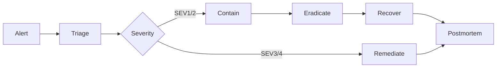

# Incident Response

## Lifecycle
Prepare → Detect → Contain → Eradicate → Recover → Learn

## Severity model
| Severity | Description | Example |
| --- | --- | --- |
| SEV1 | Critical impact to multiple services or regulatory exposure | Widespread credential compromise |
| SEV2 | High impact to a single critical service | Exposure of sensitive workload |
| SEV3 | Moderate impact or limited scope | Misconfiguration without data loss |
| SEV4 | Low impact, informational | Non-blocking alert |

## Roles
- **Incident Commander:** overall coordination and decision making.
- **Comms Lead:** stakeholder updates and communications.
- **Resolver:** technical remediation owner.
- **Forensics Lead:** evidence collection and analysis.
- **Approver:** risk owner for major actions.

## Playbooks and evidence
- Follow runbooks for triage and containment.
- Capture evidence in a centralized case folder.
- Conduct a postmortem within 5 business days.

## Incident flow

## Diagram
See the dedicated incident response diagram: [`22-diagrams/incident-response.mmd`](22-diagrams/incident-response.mmd)

## Related docs
- Runbooks: [`20-runbooks/README.md`](20-runbooks/README.md)
- Change management: [`12-change-and-release.md`](12-change-and-release.md)
