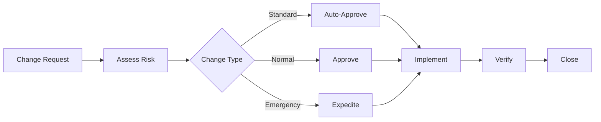

# Change and Release

## Change model
- **Standard:** pre-approved, low risk.
- **Normal:** requires assessment and approval.
- **Emergency:** expedited with post-change review.

## Pre-approval rules
- Changes must have a rollback plan.
- Security impact assessed for any policy or identity change.
- Maintenance windows applied to production changes.

## CAB-lite approach
Cloud changes use a lightweight CAB for speed with control. Approval is delegated to the Service Manager for
standardized changes.

## Change flow

## Diagram
See the change management diagram: [`22-diagrams/change-management.mmd`](22-diagrams/change-management.mmd)

## Templates
- Change request: [`21-templates/template-change-request.md`](21-templates/template-change-request.md)

## Related docs
- Exception handling: [`13-exception-handling.md`](13-exception-handling.md)
- Runbooks: [`20-runbooks/README.md`](20-runbooks/README.md)
