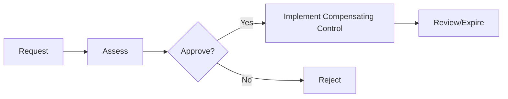

# Exception Handling

## Exception types
- **Policy exception:** temporary deviation from baseline policy.
- **Risk acceptance:** risk owner accepts a known risk.
- **Compensating controls:** alternative measures to reduce risk.

## Required fields
- Business justification
- Impacted assets
- Compensating controls
- Expiry date
- Sign-off matrix

## Review cadence
- Exceptions reviewed every 90 days.
- Expired exceptions trigger escalation to risk owner.

## Exception flow

## Diagram
See the exception handling diagram: [`22-diagrams/exception-handling.mmd`](22-diagrams/exception-handling.mmd)

## Related docs
- Risk management: [`09-risk-management.md`](09-risk-management.md)
- Templates: [`21-templates/template-exception-request.md`](21-templates/template-exception-request.md)
