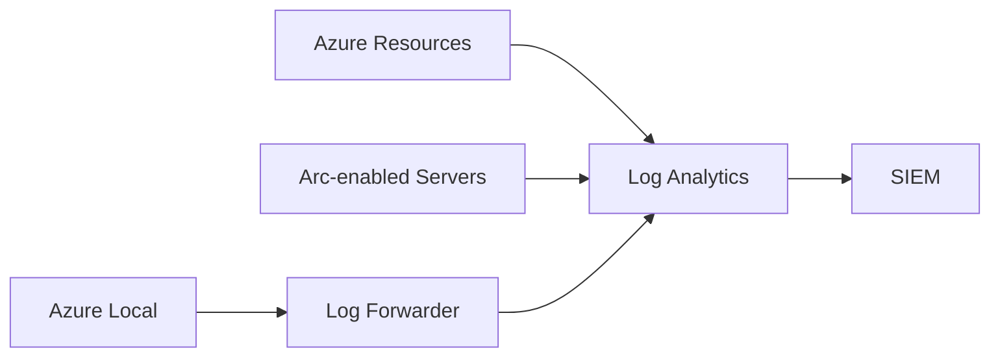

# Logging, Monitoring, and SIEM

## Logging requirements
- All production workloads must forward security logs to SIEM.
- Diagnostic settings are enforced via policy.
- Retention aligns with audit requirements.

## Monitoring model
- Detections are built and maintained as code.
- Alerts follow a tuning cadence to reduce noise.
- Metrics are tracked for detection effectiveness.

## Hybrid logging
Azure Arc-enabled servers forward logs to centralized SIEM with consistent tags and retention.

## Hybrid logging architecture (visual)

## Diagram
Hybrid logging architecture: [`22-diagrams/hybrid-logging-architecture.mmd`](22-diagrams/hybrid-logging-architecture.mmd)

## Related docs
- Hybrid/Azure Local: [`18-hybrid-azure-local.md`](18-hybrid-azure-local.md)
- Incident response: [`11-incident-response.md`](11-incident-response.md)
