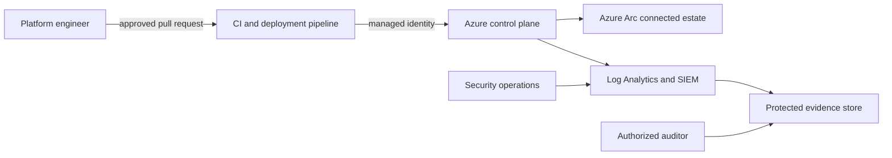

# Cloud Security Service Threat Model

## Purpose and assurance boundary

This threat model connects the public reference architecture to explicit threats, controls, evidence, and residual
risk. It is a design input, not proof of production security, certification, or tenant-specific compliance. Production
use requires a tenant-specific review, approved identities, live validation, and independent assurance where required.

## Protected assets

| Asset | Security objective | Evidence source |
| --- | --- | --- |
| Privileged identities and role assignments | Prevent unauthorized elevation and preserve accountability | Entra ID audit logs, PIM records, access reviews |
| Policy definitions and assignments | Prevent unauthorized or unsafe control changes | Git history, approvals, Azure Activity Log, policy snapshots |
| Security telemetry and evidence | Preserve confidentiality, integrity, availability, and retention | Log Analytics configuration, immutable evidence store, collection health |
| Hybrid onboarding packages and identities | Prevent supply-chain compromise and unauthorized enrollment | Signed package provenance, change record, Azure Arc inventory |
| Landing-zone network and key boundaries | Prevent unintended public exposure and secret access | IaC plan, deployment record, network and Key Vault configuration |
| Incident and exception records | Preserve investigation integrity and risk ownership | ITSM records, approvals, retention and access logs |

## Trust boundaries

1. Human-to-source boundary: contributors propose changes; reviews and required checks authorize them.
2. Source-to-pipeline boundary: workflow definitions and dependencies determine trusted execution.
3. Pipeline-to-Azure boundary: deployment identity limits mutation scope.
4. Azure-to-hybrid boundary: onboarding packages and Arc identities cross into externally operated hosts.
5. Telemetry-to-evidence boundary: collection, transformation, retention, and access can affect evidence integrity.

## Threat register

| ID | STRIDE | Threat and boundary | Preventive and detective controls | Required evidence | Residual risk and owner |
| --- | --- | --- | --- | --- | --- |
| TM-01 | Spoofing / elevation | Compromised contributor or pipeline identity changes controls | MFA, PIM, branch protection, least-privilege managed identity, signed artifacts | Access review, workflow run, deployment identity log | Identity compromise remains possible; identity owner reviews quarterly |
| TM-02 | Tampering | Policy, IaC, or evidence is altered outside the approved flow | Pull-request review, immutable action pins, audit-mode rollout, protected evidence storage | Git and Azure Activity logs, evidence integrity check | Privileged emergency changes require reconciliation; platform owner |
| TM-03 | Repudiation | Operator actions cannot be correlated to approval and deployment | Correlation IDs, change tickets, structured logs, retained activity logs | Approval, run ID, commit SHA, deployment record | External system outages may interrupt correlation; service owner |
| TM-04 | Information disclosure | Logs, secrets, or evidence are exposed through public endpoints or broad access | Managed identity, private endpoints, RBAC, secret-free logs, deny-by-default network rules | Access logs, network config, secret scanning results | Misclassification and downstream exports remain; data owner |
| TM-05 | Denial of service | Control plane, telemetry, or evidence collection becomes unavailable | Quotas, health monitoring, retry limits, break-glass runbook, tested recovery | Availability metrics, alerts, recovery test | Regional/provider outage remains; service continuity owner |
| TM-06 | Supply-chain tampering | Mutable dependencies or onboarding packages execute malicious code | SHA-pinned actions, reproducible packages, SBOM, attestations, isolated runners | Provenance, SBOM, signature verification, runner logs | Upstream trusted-source compromise remains; supply-chain owner |
| TM-07 | Boundary bypass | Hybrid host is enrolled into the wrong tenant, subscription, or policy scope | Validated identifiers, dry-run approval, scoped identity, post-onboarding checks | Dry-run JSONL, package version, Arc inventory, policy snapshot | Host administrator can alter local state; hybrid service owner |
| TM-08 | Detection failure | Missing or manipulated telemetry prevents response | Collection health alerts, analytic rule tests, retention controls, failure escalation | Ingestion health, rule results, evidence failure record | Novel attacks and blind spots remain; SecOps owner |

## Validation and review

- Review this model after architecture, identity, trust-boundary, or data-flow changes and at least quarterly.
- Validate controls through repository checks, deployment what-if, adversarial exercises, and evidence sampling.
- Record accepted residual risks with owner, expiry, treatment, and approval.
- Stop releases when high-severity threats lack an approved treatment or required evidence collection fails.

## Related documents

- Reference architecture: [`04-reference-architecture.md`](04-reference-architecture.md)
- Risk management: [`09-risk-management.md`](09-risk-management.md)
- Audit readiness: [`10-audit-readiness.md`](10-audit-readiness.md)
- Incident response: [`11-incident-response.md`](11-incident-response.md)