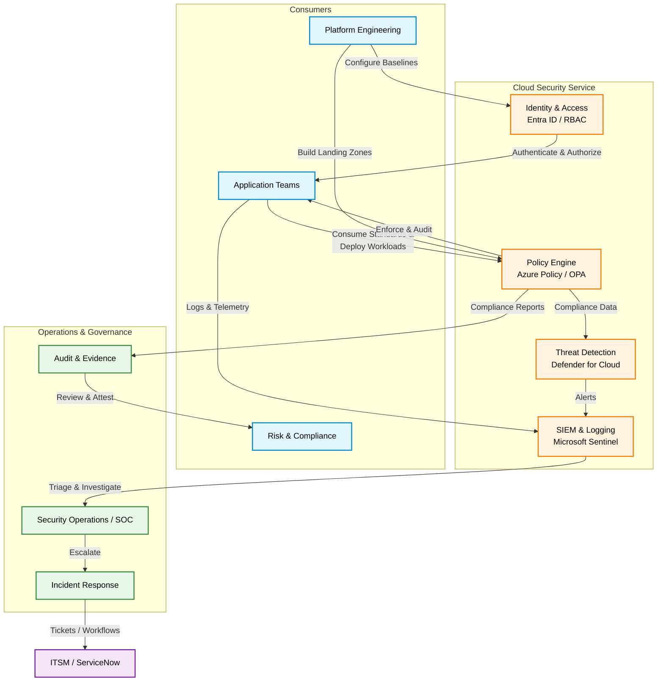

# Cloud Security Service Architecture

The Cloud Security Service is designed to provide a comprehensive, scalable, and measurable security posture across Azure and hybrid environments. It leverages cloud-native capabilities integrated with enterprise governance processes.

## High-Level Architecture

The following diagram illustrates the core components and workflow of the Cloud Security Service, showing how platform engineering, security operations, and application teams interact with the controls-as-code foundation.

## Component Details

### 1. Policy Engine (Controls-as-Code)
The policy engine acts as the governance guardrail, continuously evaluating resource configurations against defined security standards (e.g., Azure Policy, OPA). It provides both preventative (deny) and detective (audit) controls.

### 2. Identity & Access
Centralized identity management ensures least privilege access. This includes RBAC definitions, conditional access policies, and identity protection mechanisms.

### 3. Threat Detection
Continuous monitoring of cloud workloads to identify suspicious activities or vulnerabilities. Findings are aggregated and prioritized based on risk context.

### 4. SIEM & Logging
A centralized repository for security logs and telemetry. It correlates events across the environment to surface high-fidelity alerts to the Security Operations Center (SOC).

## Feedback Loops

The architecture incorporates continuous feedback loops:
- **Detection Tuning**: SecOps feedback refines SIEM rules and threat detection thresholds to reduce false positives.
- **Policy Refinement**: Application team feedback on policy friction leads to exception management or policy adjustments.
- **Automated Remediation**: Where possible, alerts trigger automated playbooks to remediate common misconfigurations.
