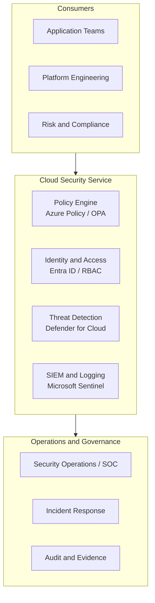

# Architecture

The Cloud Security Service is a comprehensive, scalable, measurable security posture model
across Azure and hybrid environments, connecting platform engineering, security operations, and
application teams to a controls-as-code foundation.

<!-- codex:generate-image prompt="A layered security operations center: consumer teams on an outer ring hand requests inward through a glowing policy-engine core, which routes to identity, threat detection, and SIEM stations, all feeding an audit ledger at the center; isometric, enterprise blue/graphite palette" style="isometric, enterprise, clean" replaces="mermaid-above" -->

## What this repo is (and isn't)

This repository is an operating-model artifact — service scope, governance, metrics, runbooks,
and implementation stubs — not a deployed security platform. `impl/azure/` and `impl/hybrid/`
contain Bicep and policy-as-code *examples* meant to be extended in a consumer's own
environment; nothing in this repo is deployed from this workspace.

## Deployment lock (NO-AZURE posture)

Consistent with the workspace-wide NO-AZURE-deploy hard lock, the Bicep and policy-as-code
under `impl/` are authored, linted, and reviewed as reference implementation stubs — bicep-ready
— but never deployed from this workspace. Azure deployment of any resource this repo describes
is locked until a future milestone is deliberately reached.

## Policy enforcement mode: DoNotEnforce (in progress)

The landing-zone `allowed-locations` policy assignment
([`impl/azure/landing-zone/bicep/modules/policy-assignments.bicep`](../../impl/azure/landing-zone/bicep/modules/policy-assignments.bicep))
is currently set to `enforcementMode: 'DoNotEnforce'` with `rolloutState: 'audit'` — the policy
evaluates and reports compliance without blocking deployments, the standard audit-before-enforce
rollout pattern. A formal ADR documenting this decision (Phase 33 P4) is in progress in PR #13
(`fix(bicep): pin API versions and record DoNotEnforce ADR`) and is not yet present in
`docs/adr/` on `main`. See [Decisions](Decisions.md).

<!-- docs-verified: ca23302fb25134bdd086455c91019ffea272a8b1 2026-07-08 -->
